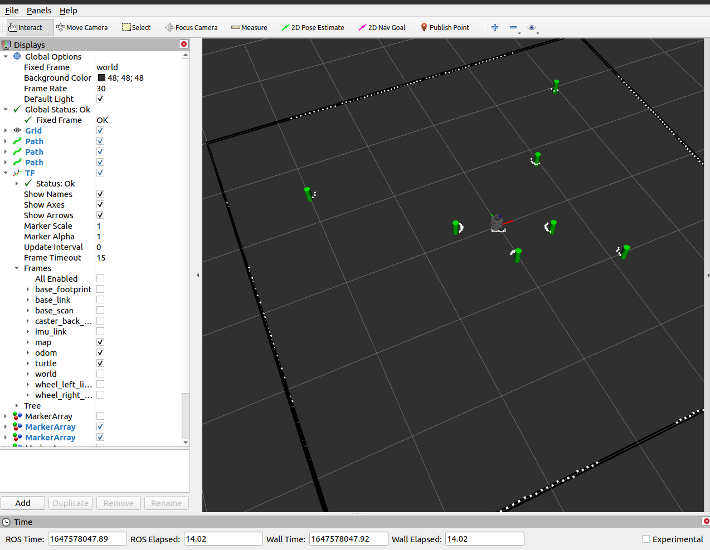
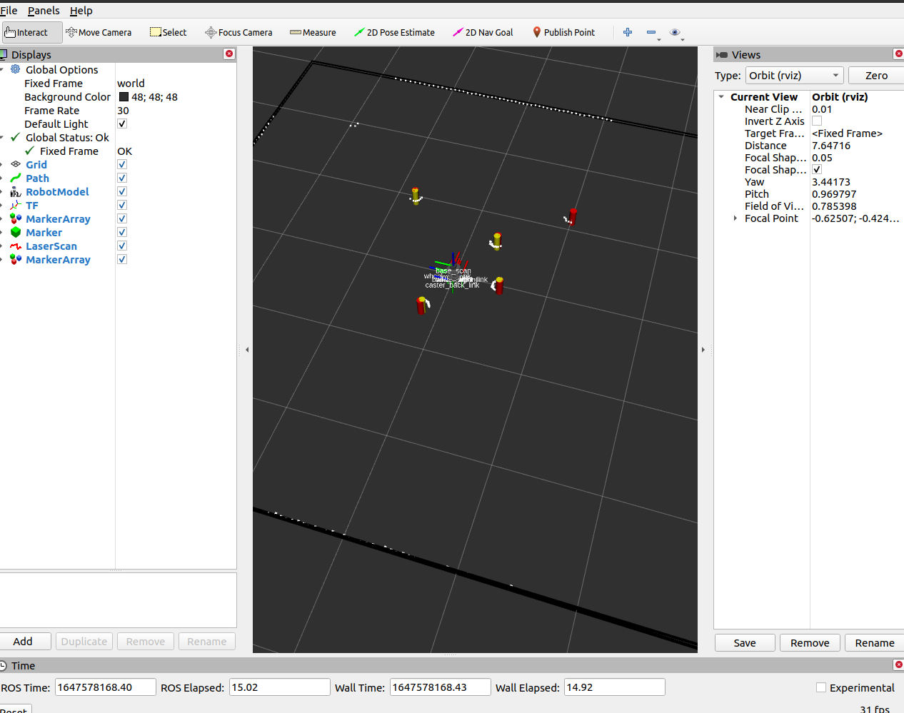
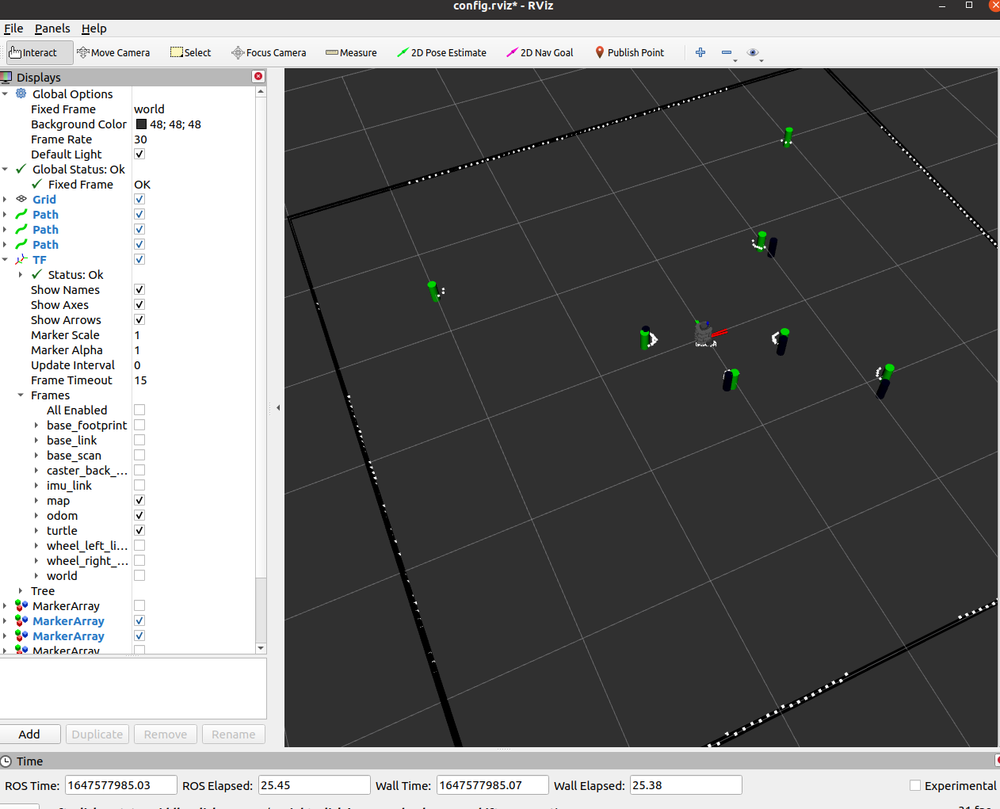

# NuSlam

* Red path: the real path of the simulated robot
* Blue path: the estimated path through SLAM, approximately matches the real path
* Green path: the estimated path through odometry only, does not match the real path

# Example Usage and results
1. Similating Slam
```
roslaunch nuslam slam.launch robot:=nusim
```


2. Detection of landmarks
```
roslaunch nuslam landmark_detect.launch nusim:=true
```


3. Data association simulation
```
roslaunch nuslam unknown_data_assoc.launch robot:=nusim
```


* you can also stimulate them with turtlebot with adding in the turtlebot name at robot.